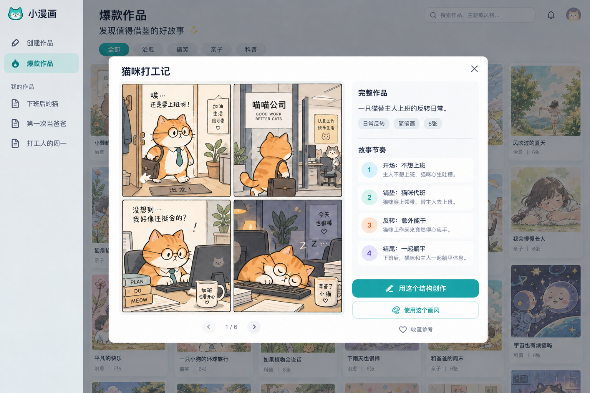
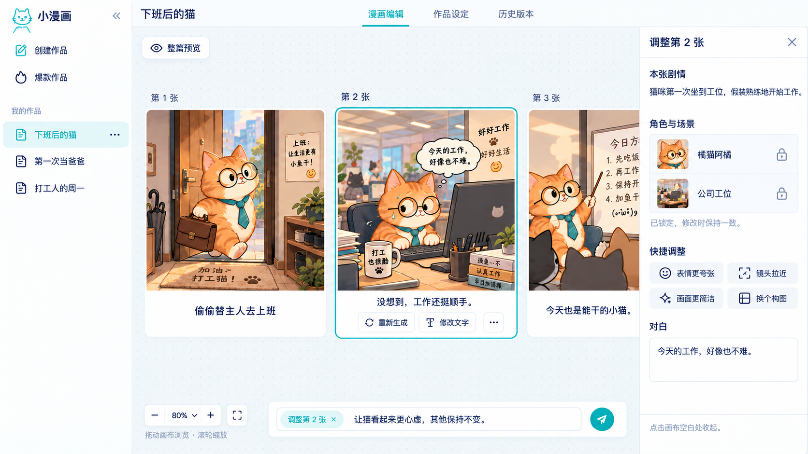
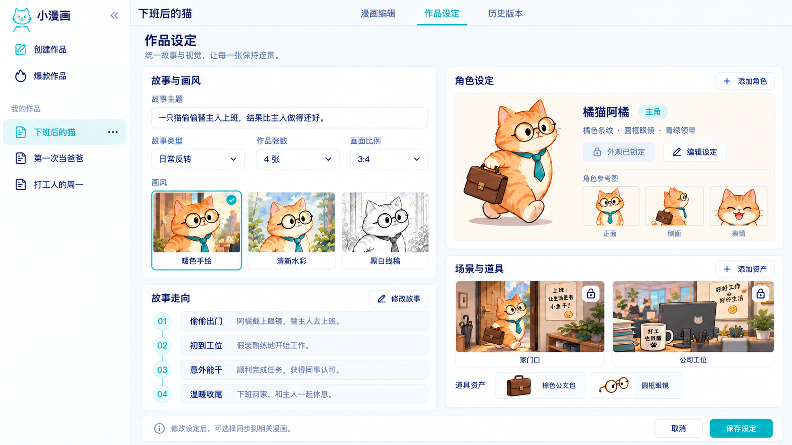

# 小漫画第一版 · 定稿页面索引

整理日期：2026-09-16。本目录保留每个页面最新确认的视觉稿，旧迭代不再作为实施依据。

**执行优先级：开发方案中的交互约定 > 本索引的统一修正规则 > 图片细节。** 图片是设计参考，不是已实现截图；个别旧图的示例文案和装饰不得成为新需求。

## 统一修正规则

- 创建页使用 01 的最终输入区，取消帮助/头像。
- 所有作品页标题左为作品名、中间三个 Tab、右侧统一“发布”；发布物料是独立工作区，不是第四个 Tab，可通过原三个 Tab 返回。
- 爆款页旧稿的通知/头像不实现；首版不呈现虚构热度数据。
- 编辑画布不换行；默认不选中卡片，右栏收起。03 是选中状态，不表示侧栏常驻。
- 图中的四张猫漫画、三张封面候选均为示意，实际依作品页数和生成结果展示。
- 设计稿中的参考插图不能直接当作完整生产模板；六套完整示例另按开发方案制作。
- 模板完整预览复用 02 的弹窗骨架；无弹窗瀑布流、未选中编辑状态是同页状态，不重复出图。

## 创建作品

底部无内边框的多行输入；模板、尺寸、张数、更多设置同排；发送图标。

## 爆款作品与完整预览

瀑布流与详情弹窗共用参考。首版展示六套示例；顶部旧图中的头像、通知不实现。

## 漫画编辑

单行横向画布；选中卡片才显示右栏。所有作品页补齐右上角发布入口。

## 作品设定

故事与画风、角色、故事走向、场景道具。补齐右上角发布入口。

## 历史版本

版本列表、只读预览、差异和恢复；恢复创建新版本。补齐右上角发布入口。

## 发布物料

按平台维护封面、标题、描述、标签；生成、修改、复制与导出。

